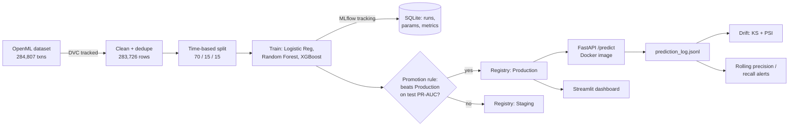

# Credit Card Fraud Detection — MLOps Pipeline

An end-to-end fraud detection system: time-based data split, model training with MLflow experiment
tracking, a model registry with automatic promotion rules, a FastAPI prediction service, a Docker
image, CI on GitHub Actions, drift and performance monitoring, and a Streamlit dashboard.

Built on the real ULB credit card fraud dataset: 284,807 transactions from two days in September
2013, 492 of them fraud (0.17%). The model is deliberately simple. The pipeline around it is the point.

**Full results and every bug found along the way:** [docs/results_and_findings.md](docs/results_and_findings.md)
**Design:** [docs/architecture.md](docs/architecture.md) · **Deployment plan:** [docs/deployment_plan.md](docs/deployment_plan.md)

## Architecture



## Results

Validation set (used for model selection):

| Model | Precision | Recall | PR-AUC |
|---|---|---|---|
| Stratified random baseline | 0.000 | 0.000 | 0.001 |
| Logistic Regression (balanced weights) | 0.030 | 0.927 | 0.843 |
| **Random Forest (tuned, deployed)** | **1.000** | 0.745 | **0.869** |
| XGBoost (tuned, not promoted) | 0.978 | 0.800 | 0.863 |

Test set (held out, later in time, scored once):

| Precision | Recall | F1 | PR-AUC | ROC-AUC |
|---|---|---|---|---|
| 0.905 | 0.731 | 0.809 | 0.776 | 0.974 |

Random Forest was chosen by validation PR-AUC. XGBoost came close, but was not promoted, because the
promotion rule compares test PR-AUC against the current Production model.

**Why not Logistic Regression?** Its recall looks strong (0.927), but precision is 0.030. On the validation set it flagged 1,667
legitimate transactions to catch 51 frauds. Not deployable as a fraud filter.

## Business impact

At the deployed threshold (0.5) on the test set, the model catches 38 of 52 known frauds (73%) and
blocks 4 legitimate transactions. Blocking is the costly failure mode for customers, so precision
matters as much as recall. The dashboard's threshold slider lets a fraud team choose the tradeoff.

## Monitoring

- **Feature drift** (train vs. test, [monitoring/drift_report.py](monitoring/drift_report.py)): all 30
  features are statistically different by KS test, but that's partly a sample-size effect. Eight
  features exceed PSI 0.2, the usual "investigate" threshold. The largest, `HourOfDay`, is an artifact
  of this dataset's 2-day span, not real behavioral drift.
- **Performance over time** ([monitoring/performance_over_time.py](monitoring/performance_over_time.py)):
  each chunk is compared to the median of all earlier chunks. On the test set this flags chunk 4
  (precision 0.667 vs. baseline 1.000, PR-AUC 0.373 vs. 0.867) and chunk 5 (precision 0.625).
  Chunks with fewer than 5 real frauds are skipped, since one prediction swings the metrics too much.

## Quick start

```powershell
python -m venv .venv
.venv\Scripts\Activate.ps1
pip install -r requirements.txt

python scripts\load_data.py         # fetch and clean the dataset
python scripts\split_data.py        # time-based split
python scripts\train.py             # train, log to MLflow, promote if the rule passes

uvicorn api.main:app --reload       # serve the Production model at localhost:8000
streamlit run dashboard/app.py      # dashboard at localhost:8501
pytest tests/ -v                    # tests
```

Docker:

```powershell
docker build -t fraud-detector-api .
docker run -p 8000:8000 fraud-detector-api
```

## Engineering challenges and how they were solved

- **Truncated download:** the first ARFF file was 17 MB instead of about 150 MB. A parser crash led to
  finding the cut-off row, and the file was re-downloaded.
- **MLflow file store deprecated:** this MLflow version refuses the plain file store, so tracking moved
  to SQLite.
- **Paths from Windows baked into the database:** the model registry stores artifact locations as
  Windows paths. Docker and CI rewrite them to the container or runner path at build or test time, so
  the local database isn't touched.
- **Model serialization security check:** MLflow flags Random Forest and XGBoost internals as untrusted
  by default. Trusted explicitly, since the models are trained in the same process.
- **FastAPI test startup:** the model wasn't loaded in tests until the app was started with a context
  manager. Migrated to the lifespan pattern.
- **Missing GitHub workflow trigger:** CI was set to run only on `main`, but the repo used `master`.
  Fixed, and CI now passes on GitHub.

## Limitations

- **Small test set:** only 52 frauds in the test split, so precision and recall carry wide uncertainty.
  Each chunk in the monitoring has 6–18 frauds.
- **Anonymized features:** V1–V28 are PCA components, so the model can't be explained in business terms.
- **Short time span:** two days of data. Real seasonality and drift need months.
- **Latency:** single-row predictions take about 200–260 ms, too slow for real-time payment authorization
  without batching or a lighter model.
- **Local-only DVC remote:** the dataset is versioned, and a plain `dvc push` didn't upload; a push by
  file name did. `dvc pull` restore hasn't been verified yet.
- **Not deployed to any cloud.** The container runs locally, and CI builds it on GitHub but doesn't
  deploy. See the deployment plan.
- **Prediction log is inside the container**, so it's lost on restart.
- **No endpoint authentication** yet.
- **Registry stages API** is deprecated in MLflow 3; migrating to aliases is future work.

## Repository layout

```
api/              FastAPI service (/predict, /health, /model-info)
dashboard/        Streamlit app
scripts/          load, split, train, path rewrite, checks
src/              shared feature code (training and serving)
monitoring/       drift report, rolling performance alerts
tests/            unit and API tests (9 passing)
docs/             architecture, results, deployment plan
mlruns/, mlflow.db  committed model artifacts and registry (see docs/architecture.md)
.github/workflows/ CI: lint, tests, Docker build
```
